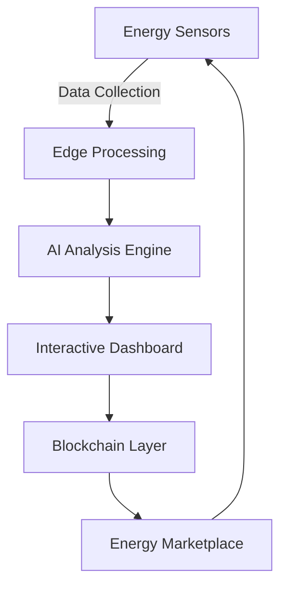

# 🌐 **SustainLabs** - AI-Powered Sustainable Energy Platform

<div align="center">
  
  
  [](https://www.typescriptlang.org/)
  [](https://reactjs.org/)
  [](https://ethereum.org/)
  [](https://polygon.technology/)
  [](https://aptoslabs.com/)
  [](https://base.org/)
  [](https://www.stellar.org/)
  [](LICENSE)
</div>

<p align="center">
  <strong>Revolutionizing sustainable energy management with AI, data visualization, and blockchain technology</strong>
</p>

---

## 🚀 **Core Features** 🌌

### **Interactive Energy Dashboard** 
- Real-time energy flow visualization with dynamic charts
- Comprehensive monitoring of renewable energy sources
- Weather impact analysis and cost projections
- Customizable views and time-range selection

### **AI-Powered Recommendations** 🔮
- Smart optimization suggestions based on energy usage patterns
- Predictive maintenance alerts for renewable energy equipment
- Cost-saving opportunities with ROI calculations
- AI-driven insights for energy efficiency improvements

### **Blockchain Integration** 🪐
- Decentralized energy trading via smart contracts
- Transparent and secure energy package marketplace
- Multi-chain support for diverse blockchain ecosystems
- Digital ownership of energy assets

### **Advanced Monitoring Systems** 🧠
- Equipment health tracking and maintenance scheduling
- Power supply monitoring with issue detection
- Real-time alerts for critical system events
- Performance metrics and efficiency tracking

---

## 🧩 **Technical Architecture** 🌐



### **Technology Stack** 💎
| Layer                | Technologies                                  |
|----------------------|-----------------------------------------------|
| **Frontend**         | React, TypeScript, Framer Motion, Recharts    |
| **Data Visualization**| Tremor, D3.js, SVG Animations                |
| **AI Integration**   | Google Generative AI, TensorFlow.js, Groq     |
| **Blockchain**       | Ethereum, Polygon, Aptos, Monad, Base, Stellar|
| **Data Streaming**   | InfinyOn/Fluvio, Screenpipe                  |
| **Real-time Engine** | Socket.IO, WebSockets                         |

---

## 🌍 **Impact & Benefits** ⚡

<div class="impact-grid">
  <div class="impact-card">
    <h3>Carbon Reduction</h3>
    <p>Track and optimize energy usage to minimize carbon footprint</p>
  </div>
  <div class="impact-card">
    <h3>Energy Efficiency</h3>
    <p>AI-driven recommendations for peak load reduction and optimization</p>
  </div>
</div>

---

## 📊 **Key Visualizations**

<div align="center">
  
  
</div>

---

## 🔍 **Monitoring & Maintenance**

<div align="center">
  
  
</div>

---

## 🚨 **Disaster Monitoring & Response**

The platform includes advanced disaster monitoring capabilities powered by blockchain technology:

- Real-time detection of environmental anomalies
- Decentralized alert system for rapid response coordination
- Immutable record of disaster events and response actions
- Cross-chain data verification for reliable disaster intelligence

<div align="center">
  
  
</div>

---

## 🤖 **AI & Blockchain Integration**

SustainLabs combines advanced AI capabilities with blockchain technology for enhanced functionality:

- **Groq-Powered Analytics**: Ultra-fast AI processing for real-time energy optimization
- **Blockchain-Verified AI Predictions**: Immutable record of AI recommendations and outcomes
- **Cross-Chain AI Agents**: Autonomous energy trading across multiple blockchain networks
- **Decentralized Machine Learning**: Federated learning models secured by blockchain consensus

<div align="center">
  
  
</div>

<div align="center">
  
  
</div>

---

## 🔗 **Blockchain Energy Marketplace**

The platform includes a decentralized marketplace for energy trading:

- Buy and sell renewable energy packages
- Transparent pricing and energy source verification
- Smart contract-based transactions
- Secure ownership transfer of energy assets

<div align="center">
  
</div>

---

## 🌐 **Multi-Chain Technology Integration** 🔗

SustainLabs leverages multiple blockchain technologies to provide a comprehensive, secure, and scalable platform for sustainable energy management. Each blockchain brings unique capabilities to different aspects of our ecosystem:

<div class="blockchain-grid" style="display: grid; grid-template-columns: repeat(3, 1fr); gap: 20px; margin: 30px 0;">

  <div class="blockchain-card" style="border: 1px solid #e0e0e0; border-radius: 10px; padding: 20px; box-shadow: 0 4px 6px rgba(0,0,0,0.1);">
    <h3>🔷 Polygon Track</h3>
    <p>High-throughput, low-fee transactions for energy credit trading with minimal environmental impact</p>
    <div align="center">
      
    </div>
  </div>

  <div class="blockchain-card" style="border: 1px solid #e0e0e0; border-radius: 10px; padding: 20px; box-shadow: 0 4px 6px rgba(0,0,0,0.1);">
    <h3>⚡ Ethereum Track</h3>
    <p>Smart contract foundation for secure, transparent energy marketplace transactions</p>
    <div align="center">
      
    </div>
  </div>

  <div class="blockchain-card" style="border: 1px solid #e0e0e0; border-radius: 10px; padding: 20px; box-shadow: 0 4px 6px rgba(0,0,0,0.1);">
    <h3>🔵 Aptos</h3>
    <p>Parallel execution engine for high-performance energy data processing and verification</p>
    <div align="center">
      
    </div>
  </div>

  <div class="blockchain-card" style="border: 1px solid #e0e0e0; border-radius: 10px; padding: 20px; box-shadow: 0 4px 6px rgba(0,0,0,0.1);">
    <h3>🧠 Groq Track</h3>
    <p>AI-accelerated blockchain operations for real-time energy optimization recommendations</p>
    <div align="center">
      
    </div>
  </div>

  <div class="blockchain-card" style="border: 1px solid #e0e0e0; border-radius: 10px; padding: 20px; box-shadow: 0 4px 6px rgba(0,0,0,0.1);">
    <h3>🔮 Monad Track</h3>
    <p>High-throughput blockchain for handling massive volumes of IoT energy sensor data</p>
    <div align="center">
      
    </div>
  </div>

  <div class="blockchain-card" style="border: 1px solid #e0e0e0; border-radius: 10px; padding: 20px; box-shadow: 0 4px 6px rgba(0,0,0,0.1);">
    <h3>🟠 Base Track</h3>
    <p>Ethereum L2 scaling solution for cost-effective energy credit microtransactions</p>
    <div align="center">
      
    </div>
  </div>

  <div class="blockchain-card" style="border: 1px solid #e0e0e0; border-radius: 10px; padding: 20px; box-shadow: 0 4px 6px rgba(0,0,0,0.1);">
    <h3>🌊 InfinyOn/Fluvio Track</h3>
    <p>Real-time data streaming for continuous energy production and consumption analytics</p>
    <div align="center">
      
    </div>
  </div>

  <div class="blockchain-card" style="border: 1px solid #e0e0e0; border-radius: 10px; padding: 20px; box-shadow: 0 4px 6px rgba(0,0,0,0.1);">
    <h3>🖥️ Screenpipe Track</h3>
    <p>Visual data processing for energy system monitoring and anomaly detection</p>
    <div align="center">
      
    </div>
  </div>

  <div class="blockchain-card" style="border: 1px solid #e0e0e0; border-radius: 10px; padding: 20px; box-shadow: 0 4px 6px rgba(0,0,0,0.1);">
    <h3>⭐ Stellar Track</h3>
    <p>Cross-border payment infrastructure for international renewable energy certificate trading</p>
    <div align="center">
      
    </div>
  </div>

</div>

<div align="center">
  
  <p><em>SustainLabs Integrated Multi-Chain Architecture</em></p>
</div>

---

## 🛠️ **Installation** 🔮

```bash
# Clone repository
git clone https://github.com/Ayushdevx/SustainLabs

# Enter project directory
cd SustainLabs

# Install dependencies
npm install

# Start development server
npm run dev
```

---

## 🌌 **Future Roadmap** 🚀

- [ ] Enhanced AI prediction models for energy optimization with Groq integration
- [ ] Cross-chain interoperability between Ethereum, Polygon, and Stellar networks
- [ ] Aptos-powered high-performance energy data verification system
- [ ] Monad integration for handling massive IoT sensor data streams
- [ ] Base L2 scaling for micro-energy transactions and carbon credit trading
- [ ] InfinyOn/Fluvio real-time data streaming for predictive maintenance
- [ ] Screenpipe visual monitoring system for energy infrastructure
- [ ] Mobile application with AR energy audit capabilities
- [ ] Advanced analytics for climate impact assessment

---

## 🧑‍💻 **Development Team** 🔮

<div class="team" style="display: flex; gap: 2rem; flex-wrap: wrap; justify-content: center;">
  <div class="member">
    <a href="https://github.com/Ayushdevx">
      
      <span>Ayush Upadhyay</span>
    </a>
  </div>
  <div class="member">
    <a href="https://github.com/shkshreyas">
      
      <span>Shreyas Kumar</span>
    </a>
  </div>
</div>

---

<div class="footer">
  <span>Built with ⚡ by Team Code Red</span>
  <span>🌍 <a href="https://github.com/Ayushdevx/SustainLabs">GitHub Repository</a> | <a href="https://github.com/Ayushdevx/SustainLabs/issues">Issues</a></span>
</div>

**Key Features:**
1. **Interactive Dashboards**: Real-time energy monitoring with dynamic visualizations
2. **AI Recommendations**: Smart suggestions for energy optimization and cost savings
3. **Multi-Chain Integration**: Support for Ethereum, Polygon, Aptos, Groq, Monad, Base, InfinyOn, Screenpipe, and Stellar
4. **Maintenance Tracking**: Equipment health monitoring and predictive maintenance
5. **Data Visualization**: Comprehensive charts and graphs for energy analytics
6. **Weather Impact Analysis**: Environmental factors affecting energy production
7. **Energy Marketplace**: Buy and sell renewable energy packages across multiple blockchains
8. **Network Monitoring**: Track energy distribution and identify issues
9. **Customizable Interface**: Personalized views and data presentation
10. **Alert System**: Real-time notifications for critical events

