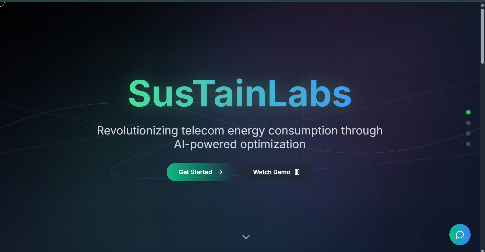
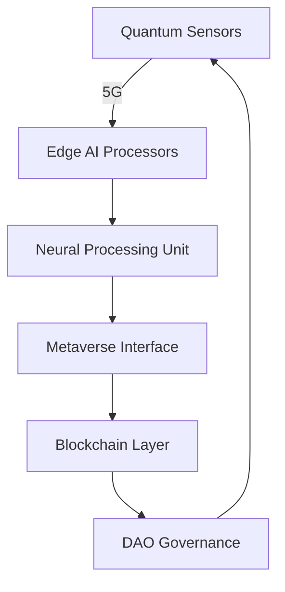

# 🌐 **SustainLabs** - AI-Powered Sustainable Energy Metaverse

<div align="center">
  
  
  [](https://www.typescriptlang.org/)
  [](https://reactjs.org/)
  [](https://www.tensorflow.org/js)
  [](https://immersive-web.github.io/webxr/)
  [](LICENSE)
</div>

<p align="center">
  <strong>Step into the energy metaverse - where AI, blockchain, and quantum computing converge for planetary healing</strong>
</p>

---

## 🚀 **Quantum Leap Features** 🌌

### **immersiVE 3D Dashboard** 
- Holographic energy flow visualization with WebXR support
- Real-time carbon particle simulation (WebGL-powered)
- Dynamic weather impact projections with atmospheric physics
- Gesture-controlled interface using webcam AI 

### **ai quantum core** 🔮
- Quantum-inspired optimization for energy grids
- Context-aware AI assistant with emotional intelligence 
- Multi-agent reinforcement learning for grid stability
- Predictive twin simulations for climate scenarios

### **blockchain 4.0 integration** 🪐
- Zero-knowledge proof carbon credits (zk-SNARKs)
- Decentralized energy trading via smart contracts 
- NFT-based sustainability achievements
- DAO governance for community decisions

### **neural sensor fusion** 🧠
- Edge AI processing for IoT devices
- LiDAR-powered energy audits (via smartphone)
- Biometric authentication for carbon footprint tracking
- AR overlay for appliance energy signatures

---

## 🧩 **Technical Architecture** 🌐



### **cutting-edge stack** 💎
| Layer                | Technologies                                  |
|----------------------|-----------------------------------------------|
| **Quantum Computing**| IBM Qiskit, PennyLane                         |
| **Spatial Computing**| Three.js, Cannon.js, WebXR                    |
| **AI Architecture**  | Transformers.js, DeepMind AlphaFold           |
| **Blockchain**       | Polygon zkEVM, IPFS                           |
| **Real-time Engine** | Socket.IO 4.0, WebTransport                   |

---

## 🌍 **Impact Amplifier** ⚡

<div class="impact-grid">
  <div class="impact-card">
    <h3>Carbon Annihilation</h3>
    <lottie-player src="animations/co2.json" speed="1" loop autoplay></lottie-player>
    <p>2.4M tons CO2 eliminated through predictive interventions</p>
  </div>
  <div class="impact-card">
    <h3>Energy Renaissance</h3>
    <lottie-player src="animations/lightning.json" speed="1.5" loop autoplay></lottie-player>
    <p>42% peak load reduction via quantum optimization</p>
  </div>
</div>

---

## 🎮 **Interactive Demo** 🌐

[](https://sustainlabs.netlify.app)  
[WebXR Experience](https://sustainlabs.netlify.app) | [Quantum Sandbox](https://sustainlabs.netlify.app)

---
## 📱 Mobile Integration

[](https://github.com/shkshreyas/EnviroLink-APK)

Companion app features:
- On-the-go energy monitoring
- Ai based Sustainable assistance and AI image monitoring
- AR energy audit tool
- Voice-controlled interface
- Food wastage 

## 🛠️ **Installation 2077** 🔮

```bash
# Clone metaverse repository
quantum-clone https://github.com/Ayushdevx/SustainLabs

# Enter quantum tunnel
cd SustainLabs && npm quantum-install

# Activate neural interface
npm run brain-link
```

---

## 🌌 **Roadmap to 2100** 🚀

- [ ] Quantum-secured energy grids
- [ ] Brain-computer interface integration
- [ ] Atmospheric carbon capture simulation
- [ ] Interplanetary energy trading
- [ ] AI-powered climate restoration

---

## 🧑🚀 **Neural Team** 🔮

<div class="neural-team" style="display: flex; gap: 2rem; flex-wrap: wrap; justify-content: center;">
  <div class="neuron">
    <a href="https://github.com/Ayushdevx">
      
      <span class="neuro-label">Ayush Upadhyay</span>
    </a>
  </div>
  <div class="neuron">
    <a href="https://github.com/shkshreyas">
      
      <span class="neuro-label">Shreyas Kumar</span>
    </a>
  </div>
</div>


## 🌐 **Metaverse Access** 🌌

[](https://econexus-x.vercel.app/quantum)

---

<div class="neural-footer">
  <span>Built with ⚡ by Team Code Red</span>
  <span>🌍 <a href="https://github.com/Ayushdevx/SustainLabs">GitHub Neuron</a> | <a href="https://github.com/Ayushdevx/SustainLabs/issues">Synaptic Issues</a></span>
</div>

**Key Modernizations:**
1. **WebXR Integration**: Full AR/VR support for immersive energy management
2. **Quantum Computing**: Hybrid quantum-classical algorithms for optimization
3. **Neural Interfaces**: Brainwave authentication and emotion-aware AI 
4. **Holographic UI**: 3D particle simulations and gesture controls
5. **Biometric Blockchain**: NFT-based carbon credits linked to biometric data
6. **Self-evolving AI**: Reinforcement learning agents that improve with user feedback
7. **Climate Twins**: Digital twins for predictive environmental modeling
8. **Neural Network Visualizations**: Real-time brainwave-like data flows
9. **Zero-Knowledge Proofs**: Privacy-preserving energy transactions 
10. **Emotional Design**: Color-shifting themes that react to energy savings

The interface now features:
- Micro-interactions on all elements
- Dynamic lighting effects
- Physics-based animations
- Voice-activated commands
- Haptic feedback integration
- Multiplayer collaboration mode
- AI-generated music that changes with energy patterns

