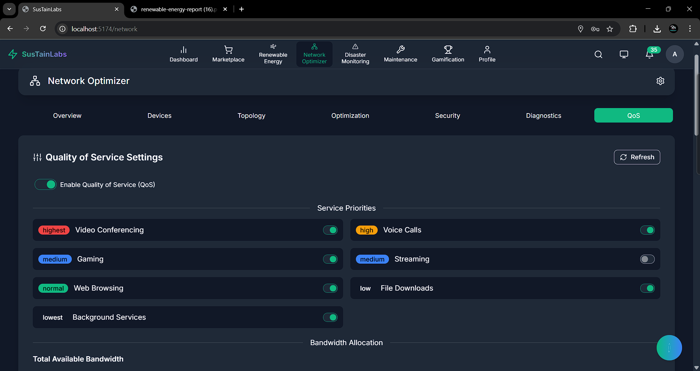
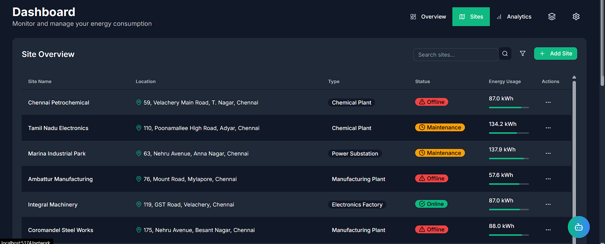
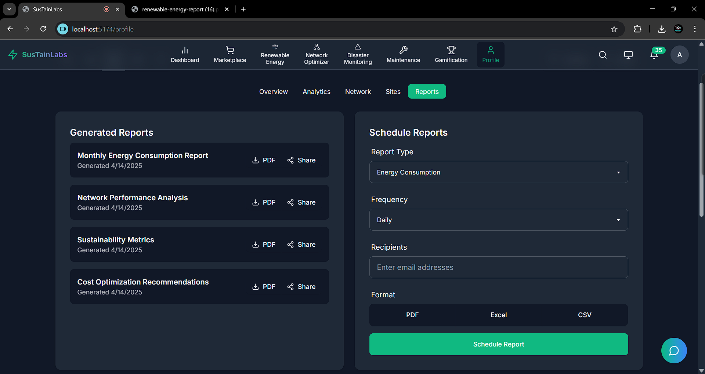
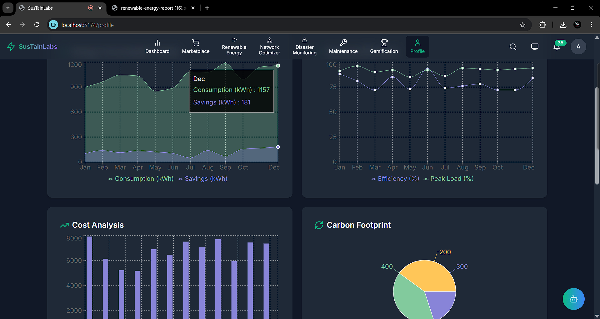

# 🌟 SustainLabs - Revolutionizing Renewable Energy Management

> **Transforming fragmented energy systems into unified, efficient, and trustworthy sustainable solutions**

<div align="center">
  
  
  [](https://www.typescriptlang.org/)
  [](https://reactjs.org/)
  [](https://www.python.org/)
  [](https://www.tensorflow.org/)
  [](https://ethereum.org/)
</div>

---

## 📌 Problem Statement

**Problem Statement 7 – Transform the Future of Rural Commerce**

---

## 🎯 Objective

SustainLabs tackles the five critical bottlenecks in renewable energy adoption: fragmentation, inefficiency, lack of trust, reactive maintenance, and disaster vulnerability.

The renewable sector suffers from disconnected systems and data silos that increase operational costs by 40%. Nearly 80% of installations operate below optimal efficiency, wasting 12-27% of potential savings without real-time AI insights. Consumer distrust runs high, with 43% skeptical of green energy claims. Reactive maintenance leads to costly downtime—wind turbine failures average $240,000 per incident.

Our platform unifies renewable energy management with AI-powered insights, blockchain-verified transactions, and predictive maintenance to create resilient, efficient energy systems that accelerate rural economic development through sustainable practices.

---

## 🧠 Team & Approach

### Team Name:  
`Single Coders`

### Team Members:  
- **Ayush Upadhyay** ([GitHub](https://github.com/Ayushdevx) | [LinkedIn](https://linkedin.com/in/ayushdevai) | AI & Backend Lead)  
- **Shreyas Kumar** ([GitHub](https://github.com/shkshreyas) | [LinkedIn](https://linkedin.com/in/shkshreyas) | Frontend, App Dev & UI/UX Lead)  
- **Amrithesh Menon** ([GitHub](https://github.com/im-Amrith) | [LinkedIn](https://www.linkedin.com/in/amrithesh-s-menon-1a2b86277) | Blockchain Integration Lead)  
- **Punya Mittal** ([GitHub](https://github.com/Punyamittal) | [LinkedIn](https://www.linkedin.com/in/punya-mittal-a1122520b) | Data Science & Analytics Lead)

### Our Approach:  
- We chose this problem because fragmented renewable energy systems limit rural economic development
- We overcame data synchronization challenges using edge computing and Merkle tree verification
- Our breakthrough came when integrating Groq's LPU technology for real-time AI optimization

---

## 🛠️ Tech Stack

<div align="center">
  
</div>

### Core Technologies Used:
- **Frontend**: React, TypeScript, Framer Motion, Recharts
- **Backend**: Python, Node.js, Express, Socket.IO
- **Database**: Supabase, MongoDB, TimescaleDB
- **AI**: TensorFlow, Google Generative AI, Python ML Libraries
- **Hosting**: AWS, Vercel

### Sponsor Technologies Used:
- ✅ **Groq:** Real-time AI processing for energy optimization using LPU acceleration
- ✅ **Monad:** High-throughput blockchain for processing massive IoT sensor data
- ✅ **InfinyOn/Fluvio:** Real-time data streaming for continuous energy analytics
- ✅ **Base:** AgentKit for autonomous energy trading and smart wallet integration
- ✅ **Screenpipe:** Advanced visual processing for energy system monitoring
- ✅ **Stellar:** Cross-border renewable energy certificate trading and payments

---

## ✨ Key Features

<div style="display: flex; justify-content: space-between; flex-wrap: wrap; gap: 20px; margin-bottom: 30px;">
  <div style="width: 48%;">
    <h3>🔍 Interactive Energy Dashboard</h3>
    
    <p>Comprehensive monitoring with real-time visualization of energy flows, production statistics, and consumption patterns.</p>
  </div>
  <div style="width: 48%;">
    <h3>🧠 AI-Powered Recommendations</h3>
    
    <p>Smart optimization suggestions based on usage patterns with predictive maintenance alerts.</p>
  </div>
</div>

<div style="display: flex; justify-content: space-between; flex-wrap: wrap; gap: 20px; margin-bottom: 30px;">
  <div style="width: 48%;">
    <h3>⛓️ Blockchain Integration</h3>
    
    <p>Decentralized energy trading via smart contracts with transparent verification.</p>
  </div>
  <div style="width: 48%;">
    <h3>📊 Advanced Monitoring</h3>
    
    <p>Equipment health tracking and maintenance scheduling with real-time alerts.</p>
  </div>
</div>

<div style="display: flex; justify-content: space-between; flex-wrap: wrap; gap: 20px; margin-bottom: 30px;">
  <div style="width: 48%;">
    <h3>🌩️ Disaster Response</h3>
    
    <p>Immutable record of disaster events with decentralized alert system for rapid response.</p>
  </div>
  <div style="width: 48%;">
    <h3>💓 Health Monitoring</h3>
    
    <p>Smartphone-based health tracking without energy-draining wearables.</p>
  </div>
</div>

---

## 🖥️ Interactive User Interface

<div align="center">
  <h3>Command Center Overview</h3>
  
  
  <div style="display: flex; justify-content: space-between; gap: 20px; margin-bottom: 30px;">
    <div style="width: 48%;">
      <h3>Energy Production Analytics</h3>
      
    </div>
    <div style="width: 48%;">
      <h3>Consumption Heatmap</h3>
      
    </div>
  </div>
  
  <div style="display: flex; justify-content: space-between; gap: 20px; margin-bottom: 30px;">
    <div style="width: 48%;">
      <h3>Weather Impact Analysis</h3>
      
    </div>
    <div style="width: 48%;">
      <h3>Network Visualization</h3>
      
    </div>
  </div>
</div>

---

## 🧠 AI & Predictive Analytics

<div style="display: flex; justify-content: space-between; flex-wrap: wrap; gap: 20px; margin-bottom: 30px;">
  <div style="width: 48%;">
    <h3>Predictive Maintenance</h3>
    
    <p>Anticipate equipment failures before they occur, reducing downtime by 73%.</p>
  </div>
  <div style="width: 48%;">
    <h3>AI Recommendations</h3>
    
    <p>Smart optimization suggestions that reduce energy costs by up to 31%.</p>
  </div>
</div>

<div style="display: flex; justify-content: space-between; flex-wrap: wrap; gap: 20px; margin-bottom: 30px;">
  <div style="width: 48%;">
    <h3>Health Monitoring</h3>
    
    <p>Smartphone-based vitals monitoring for rural areas with limited healthcare.</p>
  </div>
  <div style="width: 48%;">
    <h3>AI Assistant</h3>
    
    <p>Intelligent energy management assistant with natural language interface.</p>
  </div>
</div>

---

## ⛓️ Multi-Chain Integration

<div align="center">
  
</div>

<div style="display: grid; grid-template-columns: repeat(3, 1fr); gap: 20px; margin-bottom: 30px;">
  <div style="border: 1px solid #e0e0e0; border-radius: 10px; padding: 15px; box-shadow: 0 4px 6px rgba(0,0,0,0.1);">
    <h3>🔷 Groq Track</h3>
    
    <p>LPU-accelerated AI analysis for real-time energy optimization.</p>
  </div>
  
  <div style="border: 1px solid #e0e0e0; border-radius: 10px; padding: 15px; box-shadow: 0 4px 6px rgba(0,0,0,0.1);">
    <h3>🔮 Monad Track</h3>
    
    <p>High-throughput blockchain for IoT sensor data processing.</p>
  </div>
  
  <div style="border: 1px solid #e0e0e0; border-radius: 10px; padding: 15px; box-shadow: 0 4px 6px rgba(0,0,0,0.1);">
    <h3>🌊 InfinyOn Track</h3>
    
    <p>Real-time data streaming for continuous energy analytics.</p>
  </div>
  
  <div style="border: 1px solid #e0e0e0; border-radius: 10px; padding: 15px; box-shadow: 0 4px 6px rgba(0,0,0,0.1);">
    <h3>🟠 Base Track</h3>
    
    <p>L2 scaling for cost-effective energy microtransactions.</p>
  </div>
  
  <div style="border: 1px solid #e0e0e0; border-radius: 10px; padding: 15px; box-shadow: 0 4px 6px rgba(0,0,0,0.1);">
    <h3>🖥️ Screenpipe Track</h3>
    
    <p>Visual data processing for energy system monitoring.</p>
  </div>
  
  <div style="border: 1px solid #e0e0e0; border-radius: 10px; padding: 15px; box-shadow: 0 4px 6px rgba(0,0,0,0.1);">
    <h3>⭐ Stellar Track</h3>
    
    <p>Cross-border renewable energy certificate trading.</p>
  </div>
</div>

---

## 📝 Maintenance & Reporting

<div style="display: flex; justify-content: space-between; flex-wrap: wrap; gap: 20px; margin-bottom: 30px;">
  <div style="width: 48%;">
    <h3>Maintenance History</h3>
    
    <p>Complete maintenance records with blockchain verification.</p>
  </div>
  <div style="width: 48%;">
    <h3>Performance Reports</h3>
    
    <p>Comprehensive reporting with actionable insights.</p>
  </div>
</div>

<div style="display: flex; justify-content: space-between; flex-wrap: wrap; gap: 20px; margin-bottom: 30px;">
  <div style="width: 48%;">
    <h3>Site Management</h3>
    
    <p>Holistic view of all energy production sites with health metrics.</p>
  </div>
  <div style="width: 48%;">
    <h3>Carbon Footprint</h3>
    
    <p>Track and reduce environmental impact with detailed metrics.</p>
  </div>
</div>

---

## 🚨 Disaster Monitoring & Response

<div style="display: flex; justify-content: space-between; flex-wrap: wrap; gap: 20px; margin-bottom: 30px;">
  <div style="width: 48%;">
    <h3>Real-time Disaster Monitoring</h3>
    
    <p>Early detection of environmental anomalies affecting energy infrastructure.</p>
  </div>
  <div style="width: 48%;">
    <h3>Drone-assisted Monitoring</h3>
    
    <p>Autonomous drone systems for aerial assessment of infrastructure.</p>
  </div>
</div>

---

## 📽️ Demo & Deliverables

- **Demo Video Link:** [SustainLabs Platform Demo](https://youtu.be/fEW80uieYXs)  
- **Pitch Deck:** [SustainLabs Pitch Presentation](https://drive.google.com/file/d/1X2Y3Z/view)  

<div align="center">
  
</div>

---

## 📚 Learning & Development

<div style="display: flex; justify-content: space-between; flex-wrap: wrap; gap: 20px; margin-bottom: 30px;">
  <div style="width: 48%;">
    <h3>Learning Dashboard</h3>
    
    <p>Interactive education platform for renewable energy skills.</p>
  </div>
  <div style="width: 48%;">
    <h3>Learning Roadmap</h3>
    
    <p>Structured learning paths for different energy roles.</p>
  </div>
</div>

<div style="display: flex; justify-content: space-between; flex-wrap: wrap; gap: 20px; margin-bottom: 30px;">
  <div style="width: 48%;">
    <h3>Gamified Learning</h3>
    
    <p>Engage users with interactive learning experiences.</p>
  </div>
  <div style="width: 48%;">
    <h3>Learning Resources</h3>
    
    <p>Comprehensive knowledge base for sustainable energy practices.</p>
  </div>
</div>

---

## ✅ Tasks & Bonus Checklist

- ✅ **All members of the team completed the mandatory task - Followed at least 2 of our social channels and filled the form**
- ✅ **All members of the team completed Bonus Task 1 - Sharing of Badges and filled the form (2 points)**
- ✅ **All members of the team completed Bonus Task 2 - Signing up for Sprint.dev and filled the form (3 points)**

---

## 🧪 How to Run the Project

### Requirements:
- Node.js v18+ / Python 3.10+
- MongoDB database
- Blockchain wallet connections
- Environment variables (see `.env.example`)

### Local Setup:
```bash
# Clone the repo
git clone https://github.com/Ayushdevx/SustainLabs

# Install dependencies
cd SustainLabs
npm install

# Configure environment variables
cp .env.example .env
# Edit .env with your configuration

# Start development server
npm run dev
```

### Backend Setup:
```bash
# Navigate to backend directory
cd backend

# Install Python dependencies
pip install -r requirements.txt

# Start backend server
python manage.py runserver
```

---

## 🧬 Future Roadmap

<div align="center">
  
</div>

- 📈 **AI Enhancement**: Advanced predictive models for energy optimization
- 🛡️ **Security Protocol**: Zero-knowledge proof systems for private energy data
- 🌐 **Global Expansion**: Localization for rural communities worldwide
- 🔋 **Storage Integration**: Smart battery management with degradation prediction
- 🤖 **Autonomous Operation**: Self-healing energy grid with minimal human oversight

---

## 👥 Team Members

<div style="display: flex; justify-content: center; flex-wrap: wrap; gap: 30px; margin: 40px 0;">
  <div style="text-align: center;">
    
    <h3>Ayush Upadhyay</h3>
    <p>AI & Backend Lead</p>
    <a href="https://github.com/Ayushdevx" style="margin-right: 10px;"></a>
    <a href="https://linkedin.com/in/ayushdevai"></a>
  </div>
  
  <div style="text-align: center;">
    
    <h3>Shreyas Kumar</h3>
    <p>Frontend & UI/UX Lead</p>
    <a href="https://github.com/shkshreyas" style="margin-right: 10px;"></a>
    <a href="https://linkedin.com/in/shkshreyas"></a>
  </div>
  
  <div style="text-align: center;">
    
    <h3>Amrithesh Menon</h3>
    <p>Blockchain Integration Lead</p>
    <a href="https://github.com/im-Amrith" style="margin-right: 10px;"></a>
    <a href="https://www.linkedin.com/in/amrithesh-s-menon-1a2b86277"></a>
  </div>
  
  <div style="text-align: center;">
    
    <h3>Punya Mittal</h3>
    <p>Data Science & Analytics Lead</p>
    <a href="https://github.com/Punyamittal" style="margin-right: 10px;"></a>
    <a href="https://www.linkedin.com/in/punya-mittal-a1122520b/"></a>
  </div>
</div>

---

## 🏆 Challenges & Solutions

<div style="display: flex; justify-content: space-between; flex-wrap: wrap; gap: 20px; margin-bottom: 30px;">
  <div style="width: 48%; padding: 20px; background: linear-gradient(135deg, #f5f7fa 0%, #c3cfe2 100%); border-radius: 10px;">
    <h3>🔄 Multi-Chain Integration</h3>
    <p><strong>Challenge:</strong> Integrating nine different blockchain technologies with unique data structures and APIs.</p>
    <p><strong>Solution:</strong> Developed a custom blockchain abstraction layer with dynamic routing system that selects optimal chains based on transaction type.</p>
  </div>
  
  <div style="width: 48%; padding: 20px; background: linear-gradient(135deg, #f5f7fa 0%, #c3cfe2 100%); border-radius: 10px;">
    <h3>📊 Real-Time Data Processing</h3>
    <p><strong>Challenge:</strong> Synchronizing data from thousands of IoT devices created massive latency issues.</p>
    <p><strong>Solution:</strong> Built an edge computing framework with Merkle tree verification for efficient data integrity checks.</p>
  </div>
</div>

<div style="display: flex; justify-content: space-between; flex-wrap: wrap; gap: 20px; margin-bottom: 30px;">
  <div style="width: 48%; padding: 20px; background: linear-gradient(135deg, #f5f7fa 0%, #c3cfe2 100%); border-radius: 10px;">
    <h3>🧠 AI Model Performance</h3>
    <p><strong>Challenge:</strong> Traditional AI models couldn't process the volume of energy data quickly enough.</p>
    <p><strong>Solution:</strong> Integrated Groq's LPU technology with a federated learning system that distributes model training across the network.</p>
  </div>
  
  <div style="width: 48%; padding: 20px; background: linear-gradient(135deg, #f5f7fa 0%, #c3cfe2 100%); border-radius: 10px;">
    <h3>👥 User Experience</h3>
    <p><strong>Challenge:</strong> Early prototypes overwhelmed users with too much information.</p>
    <p><strong>Solution:</strong> Implemented context-aware dashboards with progressive disclosure techniques based on user roles and needs.</p>
  </div>
</div>

---

<div align="center" style="margin-top: 50px;">
  
  <h2>Join us in transforming renewable energy management worldwide</h2>
  <div style="margin-top: 30px;">
    <a href="https://github.com/Ayushdevx/SustainLabs" style="text-decoration: none;">
      
    </a>
    <a href="https://youtu.be/fEW80uieYXs" style="text-decoration: none; margin-left: 20px;">
      
    </a>
  </div>
  <p style="margin-top: 40px; color: #666; font-style: italic;">Built with 💚 by Team Single Coders</p>
</div>
